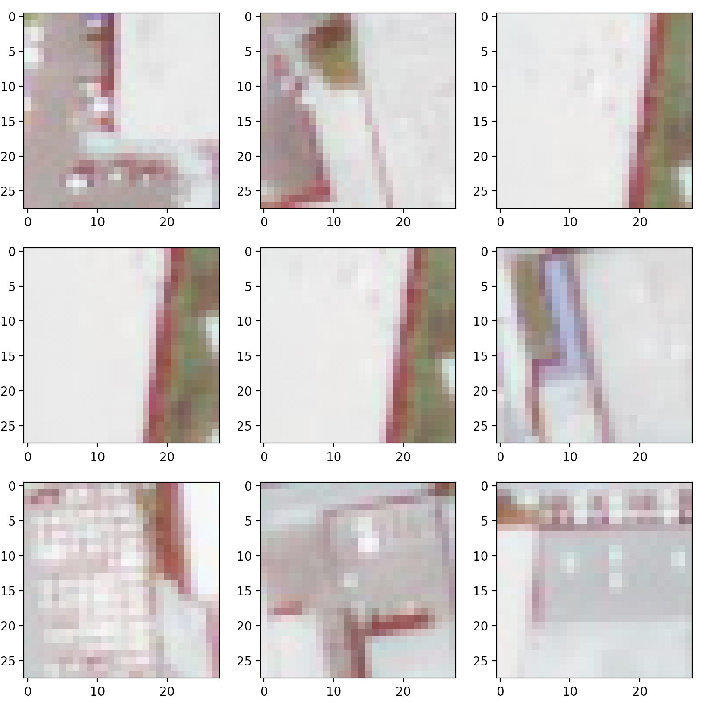
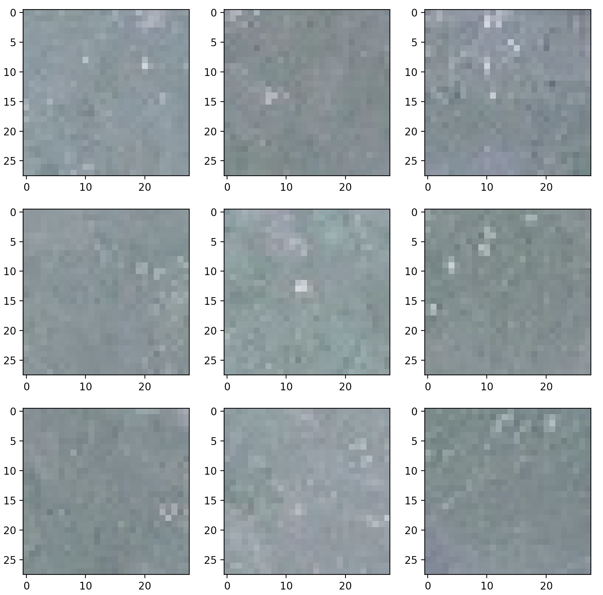
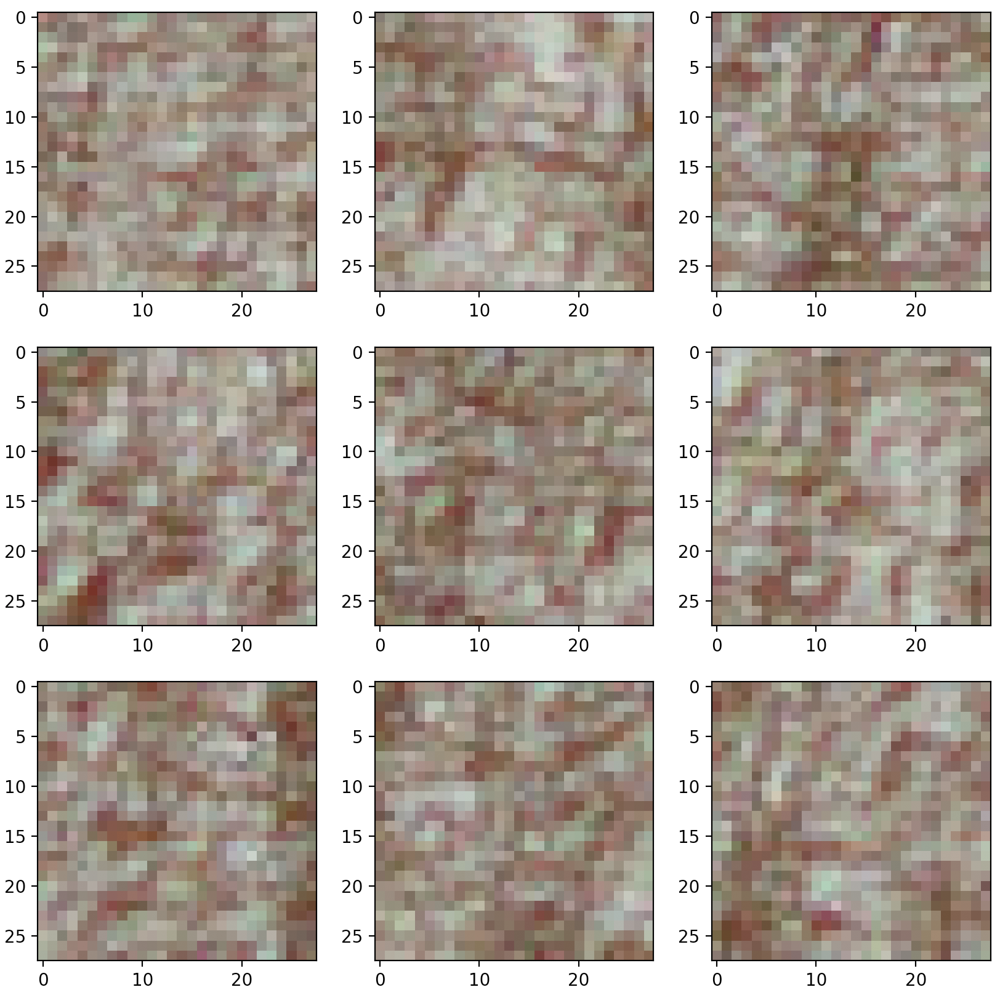

# Image Similarity

I tried to identify similar images for a given image using CNN.
Especially, I used pre-trained resent50 because of a lack of time resources.
The reason why I chose resent50 is that It doesn't hurt performance much, because of skip connections, even though resnet50 is one of the heavy models.

On top of the trained resnet with imagenet which does not include the original top, I stacked two more layers. One is for feature extraction named embedding. 
The next is a softmax layer for training new data. And I did not train resnet layers. I only train added two layers. Thus I set the trainable variable of resnet model to False.
And the named embedding layer use ReLU as a activation function because ReLU is the most prominent one and the de facto standard one.

```python
model = Sequential()
resnet = ResNet50(include_top=False, pooling='avg', weights='imagenet')

model.add(resnet)
model.add(Dense(32, activation='relu', name="embedding"))
model.add(Dense(NUM_CLASSES, activation='softmax'))
model.layers[0].trainable = False
```

There are lots of gradient descent optimization algorithms such as Stochastic gradient descent, Adam, RMSprop, etc.
Some people say that adam is the best. But others say RMSprop is better than the others. However, from my experience, There is no big difference in performance.
Thus I chose the Stochastic gradient descent.

```python
sgd = optimizers.SGD(lr=0.01, decay=1e-6, momentum=0.9, nesterov=True)
model.compile(optimizer=sgd, loss='categorical_crossentropy', metrics=['accuracy'])
```
I split all the data into train and validation. In general, train, validation and test dataset are required to estimate model performance or to compare other models   
However, I don't care about measuring model performance among models. So I only split the dataset into train and validation.

```python
cb_checkpointer = ModelCheckpoint(filepath=self.trained_weights_path, monitor='val_loss', save_best_only=True, mode='auto')

fit_history = model.fit_generator(
    self.train_generator,
    steps_per_epoch=100,
    epochs=NUM_EPOCHS,
    validation_data=self.validation_generator,
    validation_steps=100,
    callbacks=[cb_checkpointer]
)
```

After training, I built a new model from the previous model to extract image embeddings

```python
base_model = load_model(self.trained_weights_path)
intermediate_layer_model = Model(inputs=base_model.inputs, outputs=base_model.layers[1].output)
```
And then, I extracted embeddings from all of the images

```python
img = image.load_img(image_path, target_size=(IMAGE_RESIZE, IMAGE_RESIZE))
x = image.img_to_array(img)
x = np.expand_dims(x, axis=0)
x = preprocess_input(x)

intermediate_output = model.predict(x)
```

Finally, I builded a inverted index; Key is file path and value is a sorted list by cosine similarities.
The reason why I chose cosine distance instand of euclidean distance is that cosine distance is a better choice in high dimension space, because of curse of dimensionality.

```python
for key in tqdm(self.image_embedding.keys()):
    embedding = self.image_embedding[key]
    for target in self.image_embedding.keys():
        if key == target:
            continue

        target_embedding = self.image_embedding[target]
        embedding = np.array(embedding).reshape(1, 32)
        target_embedding = np.array(target_embedding).reshape(1, len(target_embedding))
        similarities[target] = cosine_similarity(embedding, target_embedding)[0][0]

    self.inverted_index[key] = sorted(similarities.items(), key=lambda x: x[1], reverse=True)[0:top_k]
```

Computing the cosine similarity takes too long in order to calculate all the distance of images because its time complexity is big o of n squared.
 So I also implemented spotify’s annoy version to compute nearest neighbors. 
 This Algorithm is one of the popular the Approximate Nearest Neighbors algorithms. 
 Usually, the ANN Algorithms are much faster than general Nearest neighbor search because the time complexities is almost constant time.

```python
self.annoyIndex = AnnoyIndex(EMBEDDING_SIZE, 'angular')

filenames = {}
for idx, key in tqdm(enumerate(self.image_embedding.keys())):
    self.annoyIndex.add_item(idx, self.image_embedding[key])
    filenames[idx] = [key, 0]

    self.annoyIndex.build(-1)
        
    self.inverted_index = {}
    print(len(self.image_embedding))
    for idx, key in tqdm(enumerate(self.image_embedding.keys())):
        indexes = self.annoyIndex.get_nns_by_item(idx, top_k)

        values = []
        for target in indexes:
            if idx == target:
                continue
            values.append(filenames[target])

        self.inverted_index[key] = values

``` 

## To run code

```bash
$ python main.py
```

## main method
```python
def main():
    imageSimilarity = ImageSimilarity()

    # download train data
    imageSimilarity.download_file()

    # split data into train and validation
    imageSimilarity.split_data()

    # train model
    imageSimilarity.train()

    # extract embeddings
    imageSimilarity.create_all_vec()

    # create inverted index with cosine similarities for searching
    imageSimilarity.calac_knn(10)

    # create inverted index with ANN for searching
    imageSimilarity.calc_knn_annoy(10)

    # check top 10 neighbors from inverted index
    imageSimilarity.get_knn("./geological_similarity/marble/PDF9R.jpg", 10)
    imageSimilarity.get_knn("./geological_similarity/gneiss/1OK58.jpg", 10)
    imageSimilarity.get_knn("./geological_similarity/andesite/0JDL9.jpg", 10)

    # get similar images from a unseen image
    imageSimilarity.get_similar_image("./data/valid/quartzite/2P42M.jpg", 10)
```
## files
- **main.py**
    - source code
- **/working/best.hdfs5**
    - trained weights
- **embeddings.json**
    - embeddings of all images
- **inverted-index.json**
    - inverted index for searching   
    
## Samples from ANN




